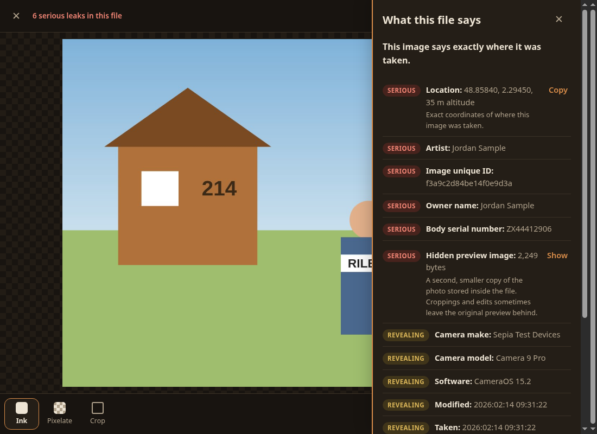
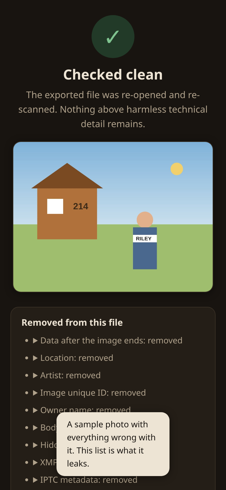

# Sepia

[](https://github.com/munzzyy/sepia/releases/latest) [](https://github.com/munzzyy/sepia/actions/workflows/ci.yml) [](LICENSE)

Share images without oversharing.

A photo of your dog can hand out your home address. Phone cameras write GPS
into every shot, plus the camera's serial number, sometimes the owner's
name, timestamps down to the second. Files hide worse things than fields:
a small preview copy that still shows what you cropped out, or a video clip
that motion-photo mode glued on after the image data. And people keep
"redacting" screenshots with a highlighter that copies right back out.

Sepia is the step before you hit send. Open the image and it shows you
everything the file says about you, ranked by how much it hurts, in plain
words: GPS becomes "this image says exactly where it was taken" with the
coordinates, and the hidden thumbnail gets shown to you as the actual
second image. Black out or pixelate what you want gone and the marks are
drawn into the pixels. Then it exports by re-encoding from the canvas, so
the new file is built from pixels alone and the original container never
touches it.

The proof screen is why this exists. After export, Sepia opens its own
output and runs the same X-ray on it that judged the original, then shows
you what's still inside. Every scrubber promises a clean file. This one
checks, in front of you, every time.

Nothing leaves your device. The web app makes no requests beyond loading
its own files, works offline once loaded, and installs from the browser
menu. The Android app takes it further: there is no INTERNET permission in
the manifest, so the OS refuses every connection the app could ever try to
make. You don't have to trust a privacy policy; the manifest is right
there to read.

<p align="center">
  
  
</p>

## Get it

Grab [sepia.apk](https://github.com/munzzyy/sepia/releases/latest/download/sepia.apk)
and install it (Android 10 or newer); that link tracks the current
release, which is exactly what Obtainium wants. Or skip the install entirely: `app/` is the whole
web app, no build step, serve it from anything that can serve files.

## Check the claims, don't take them

Run `aapt2 dump permissions sepia.apk` and the whole output is this:

```
package: io.github.munzzyy.sepia
permission: io.github.munzzyy.sepia.DYNAMIC_RECEIVER_NOT_EXPORTED_PERMISSION
uses-permission: name='io.github.munzzyy.sepia.DYNAMIC_RECEIVER_NOT_EXPORTED_PERMISSION'
```

That middle pair is androidx's self-scoped marker, a permission the app
defines and grants only to itself; it opens nothing. No INTERNET, no
storage, no anything, and CI fails the build if a real permission ever
appears. The CSP on the web app allows same-origin only. `npm test` runs
the unit suite, which cross-checks the Exif parser against exiftool
(install it, or that one check skips with a notice) and feeds
deliberately dirty files through every "clean" verdict, so a silently
broken parser fails tests instead of faking a clean scrub. `npm run e2e`
drives the real app in Chromium, redacts, exports, and then checks the
output outside the app: the parsers re-run in node against the exported
bytes, exiftool reads the same file (the suite says so loudly if exiftool
is missing), and pixel probes confirm the covered region is covered to
every edge.

## What it won't do

Read [docs/THREAT-MODEL.md](docs/THREAT-MODEL.md) before trusting it with
anything serious. Sepia removes metadata and covers the pixels you pick.
It does not find sensitive content for you (QR codes excepted, where the
browser can detect them), it refuses
PDFs rather than half-handle them, and no scrubber on earth removes a
camera sensor's noise fingerprint from the pixels themselves.

## Run it

The web app is plain files with no build step: serve `app/` from any
static host, or `node test/serve_local.mjs` locally. The Android wrapper
(`cd android && ./gradlew assembleRelease`) syncs `app/` into its assets on
every build, so the APK can't drift from the site.

```
npm test              # unit tests (node >= 24)
npm run e2e           # chromium end-to-end suites
npm run fixtures      # regenerate demo + test images
```

## Bugs, holes, contributions

Anything metadata that survives an export the proof screen does not
report is the bug that matters; [SECURITY.md](SECURITY.md) has the
private route for that. Everything else: issues and pull requests are
open and welcome. Releases list the APK's sha256 and the signing
certificate digest, so you can verify what you installed.

MIT.
