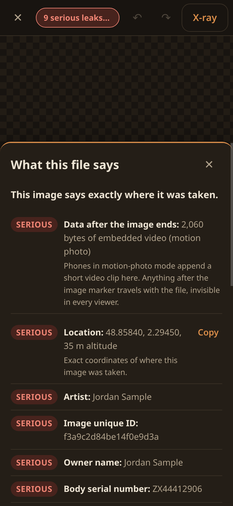
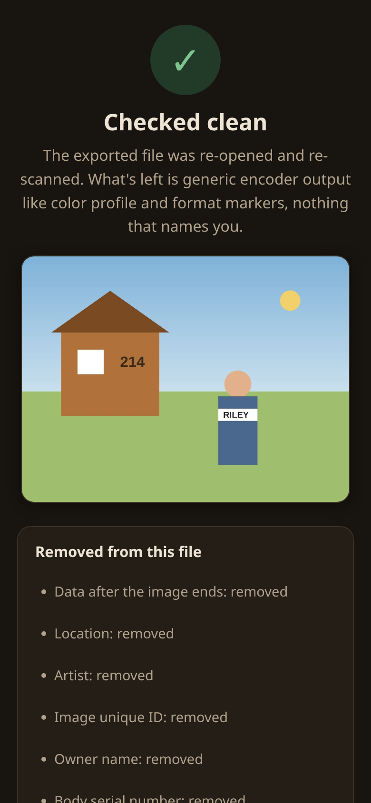

# Sepia

[](https://github.com/munzzyy/sepia/releases/latest) [](https://github.com/munzzyy/sepia/actions/workflows/ci.yml) [](LICENSE)

Share images without oversharing.

A photo of your dog can hand out your home address. Phone cameras write GPS
into every shot, plus the camera's serial number, sometimes the owner's
name, timestamps down to the second. Files hide worse things than fields:
a small preview copy that still shows what you cropped out, or a video clip
that motion-photo mode glued on after the image data. And people keep
"redacting" screenshots with a highlighter that copies right back out.

Sepia is the step before you hit send. Open the image and it shows you
everything the file says about you, ranked by how much it hurts, in plain
words: GPS becomes "this image says exactly where it was taken" with the
coordinates, and the hidden thumbnail gets shown to you as the actual
second image. Black out or pixelate what you want gone and the marks are
drawn into the pixels. Then it exports by re-encoding from the canvas, so
the new file is built from pixels alone and the original container never
touches it.

The proof screen is why this exists. After export, Sepia opens its own
output and runs the same X-ray on it that judged the original, then shows
you what's still inside. Every scrubber promises a clean file. This one
checks, in front of you, every time.

Nothing leaves your device. The web app makes no requests beyond loading
its own files, and once it's served over https it works offline and can be
installed: Chrome and Edge from the browser menu, Safari on iPhone through
Share, then "Add to Home Screen". The Android app takes it further: there
is no INTERNET permission in the manifest, so the OS refuses every
connection the app could ever try to make. You don't have to trust a
privacy policy; the manifest is right there to read.

<p align="center">
  
  
</p>

## Get it

**Android:** grab [sepia.apk](https://github.com/munzzyy/sepia/releases/latest/download/sepia.apk)
and install it (Android 9 or newer). It's not on the Play Store, so Android
will warn you about installing from outside it; that's expected for any APK
that isn't store-distributed, not a sign anything is wrong here, and the
"Check the claims" section below is exactly how you check for yourself. The
download link always points at the current release, which is also what
[Tern](https://github.com/munzzyy/tern) (an app that watches GitHub releases and updates sideloaded apps
for you) tracks.

Android 9 works, with two catches. Google's last security fixes for Android 9
came out in January 2022, so a phone that old is easier to break into, and
Sepia says so once, the first time it opens there. Sepia also runs inside
Android System WebView and needs version 108 or newer. A phone that gets
updates through Google Play should already have it; with an older WebView,
Sepia explains how to update it instead of opening to a blank screen.

[](https://tern.munzzyy.dev/add/?url=https%3A%2F%2Fgithub.com%2Fmunzzyy%2Fsepia)

**Web:** open [sepia.munzzyy.dev](https://sepia.munzzyy.dev). It is this
repo's `app/` folder served as plain files with the headers in
`app/_headers`, and after the first load it works offline. `app/` is the
whole app, no build step, no server side, so you can also run your own
copy: `node test/serve_local.mjs` serves it locally, or point any static
file host at the folder.

**iPhone:** open [sepia.munzzyy.dev](https://sepia.munzzyy.dev) in Safari,
tap Share, then "Add to Home Screen". There is also a native wrapper in
`ios/` you can build with Xcode on a Mac. What the wrapper does and does
not match from the Android app, and how to build it, is spelled out in
[docs/IOS.md](docs/IOS.md).

## How it works

Open an image and Sepia shows you everything the file says about you. Black
out or pixelate whatever you don't want seen; those marks get burned into
the pixels. Export re-encodes from scratch, from pixels alone, and then
Sepia re-opens its own output and checks it the same way it checked your
original, so you see the proof instead of taking its word for it.

## What it won't do

Read [docs/THREAT-MODEL.md](docs/THREAT-MODEL.md) before trusting it with
anything serious. Sepia removes metadata and covers the pixels you pick.
It does not find sensitive content for you (QR codes excepted, where the
browser can detect them), it refuses
PDFs rather than half-handle them, and no scrubber on earth removes a
camera sensor's noise fingerprint from the pixels themselves. Covering a
face or a block of text on the canvas needs a pointer drag or a hardware
keyboard; a touchscreen screen reader can't do that yet, though every
metadata item the X-ray lists still comes out on export with no canvas
interaction at all.

## Check the claims, don't take them

Run `aapt2 dump permissions sepia.apk` and the whole output is this:

```
package: io.github.munzzyy.sepia
permission: io.github.munzzyy.sepia.DYNAMIC_RECEIVER_NOT_EXPORTED_PERMISSION
uses-permission: name='io.github.munzzyy.sepia.DYNAMIC_RECEIVER_NOT_EXPORTED_PERMISSION'
```

That middle pair is androidx's self-scoped marker, a permission the app
defines and grants only to itself; it opens nothing. No INTERNET, no
storage, no anything, and CI fails the build if a real permission ever
appears. The CSP on the web app allows same-origin only. `npm test` runs
the unit suite, which cross-checks the Exif parser against exiftool
(install it, or that one check skips with a notice) and feeds
deliberately dirty files through every "clean" verdict, so a silently
broken parser fails tests instead of faking a clean scrub. `npm run e2e`
drives the real app in Chromium, redacts, exports, and then checks the
output outside the app: the parsers re-run in node against the exported
bytes, exiftool reads the same file (the suite says so loudly if exiftool
is missing), and pixel probes confirm the covered region is covered to
every edge. A Firefox suite runs the export and batch paths again there,
since Firefox's encoder writes different bytes.

## Run it

The web app is plain files with no build step: serve `app/` from any
static host, or `node test/serve_local.mjs` locally. Offline (the service
worker) and installability need a secure origin, which means https, or
localhost while you test. `app/` can sit at the domain root or under a
subpath like `example.com/sepia/`. Plain http from anywhere else still
works, it just won't cache. The Android wrapper (`cd android && ./gradlew assembleRelease`)
syncs `app/` into its assets on every build, so the APK can't drift from the
site.

```
npm test              # unit tests (node >= 24)
npm run e2e           # chromium and firefox end-to-end suites
npm run fixtures      # regenerate demo + test images
```

## Bugs, holes, contributions

Anything metadata that survives an export the proof screen does not
report is the bug that matters; [SECURITY.md](SECURITY.md) has the
private route for that. Everything else: issues and pull requests are
open and welcome. Releases list the APK's sha256 and the signing
certificate digest, so you can verify what you installed.

Sepia ships English and Spanish (`app/js/strings-es.js`). Adding a
language means a new catalog file in the same shape, keyed by the English
source string, added to `CATALOGS` in `app/js/i18n.js`, and to
`LOCALE_CHOICES` for the picker. `node tools/extract-strings.mjs` lists
every string a catalog needs and fails CI if one goes missing or stale, so
a partial translation gets caught before it ships, not after. No hosted
translation platform exists yet; a pull request against the catalog file
is the whole flow today.

## Support

If you want to help keep Sepia going, you can sponsor on [GitHub Sponsors](https://github.com/sponsors/munzzyy) or send Monero to:

```
8BApLkfsBS39oNXz4L1qCmZ7f5zKVRr1qLJgrHddRZb4JRcnjDkcKdk7wW7uThCeV9CuLn8o7gAn8d6vFeWNiyeXSmrRUSq
```

## License

[GPL-3.0-or-later](LICENSE). You can use, study, change and share it. If you
distribute a copy or a modified version, it has to stay under the GPL and
come with its source. Releases up to v0.4.1 were under MIT.
